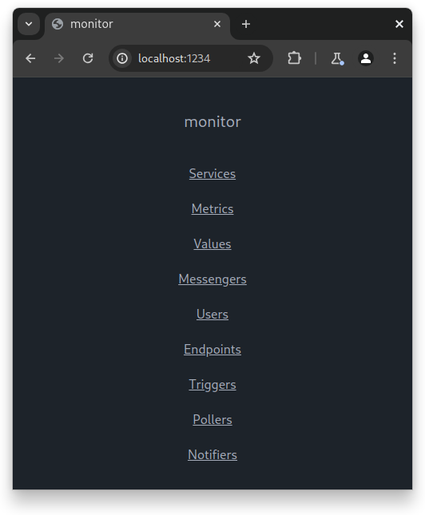
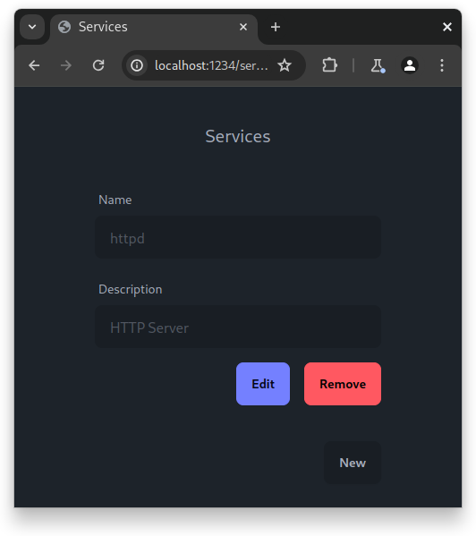
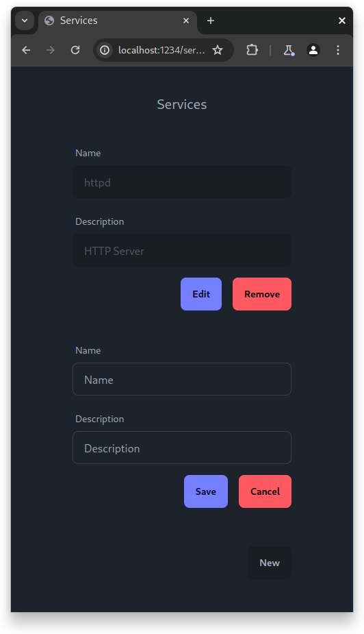

# Терминология

## Сервис

Некоторая программа, состояние которой следует отслеживать.

## Метрика

Измеряемая величина, характеризующая состояние сервиса.

## Значение

Значение метрики.

## Мессенджер

Программа для обмена сообщениями.

## Пользователь

Пользователь данной программы, заинтересованный в получении сообщений о состояниях сервисов.

## Эндпоинт

Идентификатор пользователя в мессенджере.

Например, в Telegram это уникальное число, а в электронной почте - почтовый адрес.

## Триггер

Структура, которая несет информацию о том, что при определенном значении необходимо сформировать и отправить сообщение на указанный эндпоинт.

## Подписывающий плагин

Плагин для данного программного средства, способный сообщать текущее значение определенной метрики.

## Публикующий плагин

Плагин для данного программного средства, способный формировать и отправлять сообщения в определенный месснджер.

# Получение доступа к пользовательскому интерфейсу

Чтобы получить ссылку на пользовательский интерфейс, обратитесь к администратору. Получив ссылку, следует ввести её в адресную строку веб-браузера. По умолчанию пользовательский интерфейс доступен [в локальной сети на порте 1234](http://localhost:1234).

# Использование интерфейса

## Стартовая страница

Перейдя по ссылке на пользовательский интерфейс, можно будет увидеть веб-страницу, изображённую ниже.

При этом можно будет перейти на следующие страницы:

- `/services` - настройка сервисов;
- `/metrics` - настройка метрик;
- `/values` - настройка значений;
- `/messengers` - настройка мессенджеров;
- `/users` - настройка пользователей;
- `/endpoints` - настройка эндпоинтов;
- `/triggers` - настройка триггеров;
- `/pollers` - настройка подписывающих плагинов;
- `/notifiers` - настройка публикующих плагинов.

На скриншоте ниже можно увидеть скриншот страницы для настройки сервисов.

## Назначение страниц

Сервисы, метрики, значения, мессенджеры и плагины должны настраиваться согласованно с кодом самих плагинов. Предполагается, что пользователи, не являющиеся разработчиками плагинов, не должны пользоваться данной функциональностью. Однако так как все пользователи являются сотрудниками ИТ-отдела, данные страницы открыты для всех.

Остальные страницы предназначены для всех пользователей без ограничений.

## Создание ресурсов

На каждой из страниц содержится список форм, внизу которой находится кнопка "New" для создания нового ресурса. При нажатии на кнопку "New" над ней должна появиться форма нового ресурса. В форме должны содержаться поля ввода, которые делятся на текстовые поля и поля выбора. Под полями ввода должны находиться кнопки "Save" для сохранения ресурса и "Cancel" для отмены. На скриншоте ниже можно увидеть скриншот страницы для настройки сервисов после нажатия кнопки "New".

При сохранении формы поля ввода станут неактивными.

## Редактирование ресурсов

Чтобы редактировать ресурс, следует нажать кнопку "Edit" под ними. При этом будут активны только поля ввода, которые не являются идентифицирующими. В случае, если необходимо редактировать и идентифицирующие поля, необходимо удалить ресурс, нажав кнопку "Delete" под полями ввода, и создать его заново.

При создании ресурсов необходимо соблюдать следующую последовательность заполнения данных:

- метрики должны создаваться когда доступен хотя бы один сервис;
- значения должны создаваться когда доступна хотя бы одна метрика;
- эндпоинты должны создаваться когда создан хотя бы один мессенджер и хотя бы один пользователь;
- триггеры должны создаваться когда созданы хотя бы одно значение и хотя бы один эндпоинт;
- подписывающие плагины должны создаваться когда создано хотя бы одно значение;
- публикующие плагины должны создавать когда создан хотя бы один мессенджер.

Некоторые кнопки "Edit" не является доступными по причине того, что все поля формы являются идентифицирующими.

# Получение идентификатора пользователя в Telegram

Так как любой пользователь может сменить своё имя пользователя в любой момент, для идентификации используется уникальный идентификатор. Данный уникальный идентификатор можно получить с помощью бота в Telegram с именем пользователя [@userinfobot](https://t.me/userinfobot). В случае, если данный бот не доступен, обратитесь к администратору.
